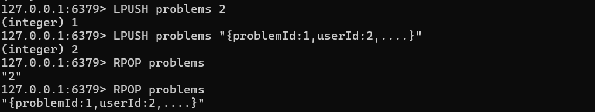
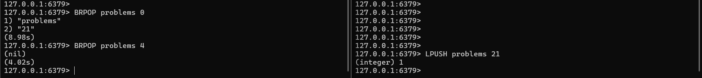

## WebSockets
Websockets are a type of protocol to communicate. It helps to maintain a persistent connection between client and server. \
Persistent are connection that are consistent. \
A normal http connection is not persistent as it will again and again ask the server request for some data while an websockets maintains a connection and send and reccieve over it. \
Websockets are used mostly where we want to deal in real time data. \ 
Otherwise we have to send request again and again, wait for its response. \
This will create inconsistency in our server and overhead willl increase. \

#### Polling
The other concept that is used in leetcode to maintain a connection with the server is polling.
In this we again and again send requests to the server like after every second we send a request to check if the data is present or not.
It is not that much helpful in the server where the data requested is huge like on a cryptocurrency website. They would need to get update of every coin every seconds. They need to send numerous ammount of reqeust to the server which is not good at all. So they maintain a WebSocket connection. \
Polling is not DDOS as DDOS stand for distributed denial of services that multiple requests are send from different ip address as if one ip send a huge amount of data it could cause rate limit of that ip. \

#### Long Polling
It is somewhat similar to polling only in this we wait for the request to get accepted like whenever the server has the response it can send untill it will wait in another http request.\

### Types of Websockets implementation
Socket io ==> It is very least used websocket implementation because it is harder to support multiple platforms. It is still used many places because it is very beginner-friendly. But we will avoid using it. \
npmjs/websockets ==> It is very good and the core of the websockets. We will use this or the other websocket but not the socket io. \
websockets/we ==> It is also the core and very good in words of implementation. We will use this in this learning journey

### Initialisation of websockets
We first kick thing by initailizing a npm enviroment by just\
    npm init -y

Then we need to initialise the type script enviroment by just
    npx tsc --init

Then we need to update the tsconfig.json so that the output of the build is in root dir
    "rootDir":"./src"
    "outDir":"./dist"

Then we need to add the ws library
    npm i ws @types/ws

Then we need to add some code which is in src/index.ts
Go through the code and understand it.

To start the server run the build command that goes like this
    tsc -b

Then we run the build product 
    node dist/index.js
As we have stored the data in the dist folder

After you understood the server side websocket read the react app created outside this folder

Now we know how websockets works lets see different archietectures

### Archietectures
#### 1. Pub/Sub
In this architecture the server is the publisher and the client is the subscriber. 
The client will subscribe to the server and the server will publish the data to the client.
The client will be able to recieve the data from the server.
The server will be able to send the data to the client.

#### 2. Queue
In this we maintain a queue for the client data they send
The client sends the data to the main server instead of running the data on the main server, server maintains a queue and have some workers that can run the data or whatever their use is
The workers are able to pick the data from the queue and run it.
After they run the task they either send the data to the server or send the data to a pub sub which is the publisher and the subscriber architecture.

#### How LeetCode Works
LeetCode uses long polling method in the client side 
When code is first submitted, the code is sent to the server. \
The server maintains a queue archietecture in which it keeps all the data in the queue and have some workers that run the code.
The worker is able to pick the data from the queue and run it.
After they run the code they send the result to the pub sub.\
Each client also has a websocket layer connected to it
When the pub sub recieves the result it sends it to the client through the websocket layer.
The websocket layer also helps the client to get information about it from the database as the pubsub is also connected to the database

### Redis
Redis is a in memory data store. It is used for storing data in memory. \ 
It is mostly used for caching data. \
It can also be used to database storing but not very good at it. \
It basically helps to reduce database calls
For eg. If we need to render some data for a website and the databse is update every once a week and the traffic is huge so each time it will call from database 
It will be a huge load on the database. So we can store the data in redis and then we can get the data from redis instead of database. \
This will reduce the load on the database. \
It will act as a cache memory and also very fast as comparing from fetching data from database. \
It also keep a log book that helps if the redis is down then we replay all the process from the log book and again dont need to make a database call
Whenever there is write operation on the database. The back end clears the redis and re add data in redis from database

To store the data in redis there are two ways which are
1. AOF(Append Only File) --> In this we maintain queue for all the data that has been added to the redis. So if the redis is down we can replay all the data from the AOF. It is not suitable for large databases because if we replay all the events for a database which has been running for months the log book will be huge and take a long time to run so we use another method to store it
2. RDB(Redis Database File) --> In this the redis take a snap shot every once and while. We can specify when to take the snap shot and if ever redis goes down it can run only the snap shoted process and the current process and get back to normal

#### Redis Initialisation
To use redis either you can install your system locally or you can use an container and use redis in that
To use redis in a container you can use docker. \
Use the commnad
    docker run --name lakshay-redis -d -p 6379:6379 redis
This will create a container in detached mode with port 6379 mapped to port 6379 of the container. \

Then we can exec manually by using the commnad
    docker exec -it 570b4538f7484 /bin/bash

We are now command prompt of the redis container we can use redis in that command prompt using 
    redis-cli

We have entered in the redis cli we can now run the redis comand here

    set user "Lakshay"
This will set the user as lakshay this is necessary whenver we start new container

    SET tracks "[{title:'Lakshay',description:''}]"
This will set the tracks from nil to this

To get tracks we can use the commnad
    GET tracks

To delete all tracks we can use the command
    DEL tracks

We can store the map inside the redis also by using the command
    HSET user:169 name "Rahul" email "cool.rahulxyz@gmail.com" age 20

We have set the data for user 169 and now if we want to get any data about it we can use the commmand
    HGET user:169 name
    or
    HGET user:169 email
    

##### Redis Queues
We can use the redis to store the data in form of queue i.e push from end and pop from other end
If we push and pop from same end it will become a stack
problems is the name of the queue

To push data in the queue we can use the command
    LPUSH problems 1

To pop we need to run the command
    RPOP problems
    

Block pop is something in which we can block the execution of the program until we get the data from the queue 
If the queue is empty then we wait for certain time that we enter in the block pop command and then we wait for the data to be available in the queue till that time else return nil
    BRPOP problems 0

This command will block the commnad line until we push something in the queue by using the command
    LPUSH problems 12

The right image command is run late and not parallely

##### NOTE : These commnads will run by the node js in the backend we dont have to manually run it everytime in the commnad line

#### Redis Initialisation in Node js
To connect to the node js server we can use the redis package in node 
In the example we have first set up a worker and a server
Server will add data to the redis queue and worker will pop from the queue and run the code in his server
To get the idea what is happening first go to the express-server/src/index.ts in the redis-express-worker folder 

After you understood how server is adding data to the queue then you should learn how workers are picking up code from the queue and running it
Go to worker inside the redis-express-worker 
In that go to worker/sec/index.ts
In that file you will see that we are using the redis package to connect to the redis server 
One of the greatest benefit is that even if the workers are down the data is stored in redis queue and whenver works is up it can pick up the data from the queue and execute so there is no data lose