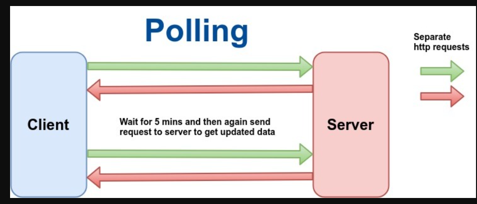
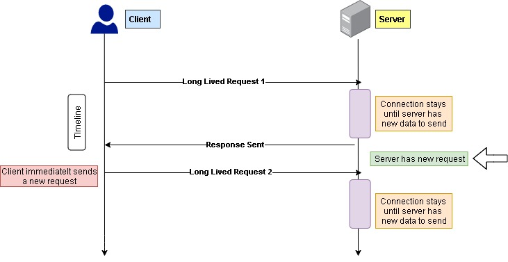

## WebSockets
Websockets are a type of protocol to communicate. It helps to maintain a persistent connection between client and server. \
Persistent are connection that are consistent. \
A normal http connection is not persistent as it will again and again ask the server request for some data while an websockets maintains a connection and send and reccieve over it. \
Websockets are used mostly where we want to deal in real time data. \ 
Otherwise we have to send request again and again, wait for its response. \
This will create inconsistency in our server and overhead willl increase. \

#### Polling
The other concept that is used in leetcode to maintain a connection with the server is polling.
In this we again and again send requests to the server like after every second we send a request to check if the data is present or not.
It is not that much helpful in the server where the data requested is huge like on a cryptocurrency website. They would need to get update of every coin every seconds. They need to send numerous ammount of reqeust to the server which is not good at all. So they maintain a WebSocket connection. \

#### Long Polling
It is somewhat similar to polling only in this we wait for the request to get accepted like whenever the server has the response it can send untill it will wait in another http request.\

### Types of Websockets implementation
Socket io ==> It is very least used websocket implementation because it is harder to support multiple platforms. It is still used many places because it is very beginner-friendly. But we will avoid using it. \
npmjs/websockets ==> It is very good and the core of the websockets. We will use this or the other websocket but not the socket io. \
websockets/we ==> It is also the core and very good in words of implementation. We will use this in this learning journey

### Initialisation of websockets
We first kick thing by initailizing a npm enviroment by just\
    npm init -y

Then we need to initialise the type script enviroment by just
    npx tsc --init

Then we need to update the tsconfig.json so that the output of the build is in root dir
    "rootDir":"./src"
    "outDir":"./dist"

Then we need to add the ws library
    npm i ws @types/ws

Then we need to add some code which is in src/index.ts
Go through the code and understand it.

To start the server run the build command that goes like this
    tsc -b

Then we run the build product 
    node dist/index.js
As we have stored the data in the dist folder
